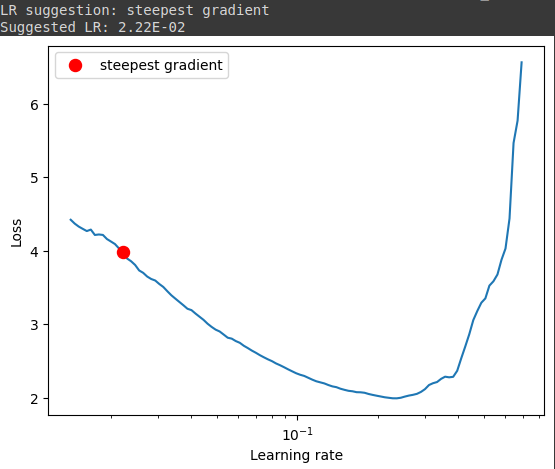
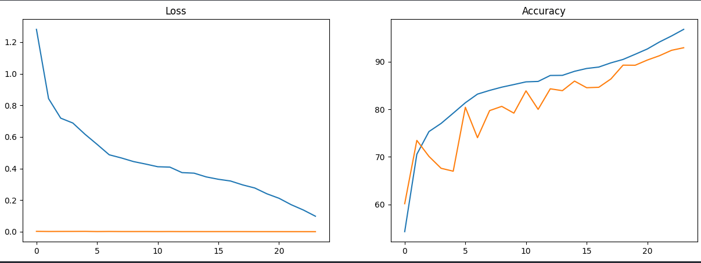

# Session 10 Assignment

This assignment is to learn about custom resnet convolutions. The objective was to get more than 90% accuracy in test/dev set for CIFAR10 dataset such that model includes one PrepLayer, Three layers like layer1, layer2 and layer3 and residual block which is used with layer1 and layer3. We have to use albumentations library for augmentations. Need to employ one cycle learning rate policy as well.

Ran the notebook in colab.

## Model

- [Notebook](session10.ipynb)

- Training/Test Accuracy: 96.78%, 92.92%

- Our custom resnet model summary is shown below:

```
==========================================================================================
Layer (type:depth-idx)                   Output Shape              Param #
==========================================================================================
MyResNet                                 [512, 10]                 --
├─Sequential: 1-1                        [512, 64, 32, 32]         --
│    └─Conv2d: 2-1                       [512, 64, 32, 32]         1,792
│    └─BatchNorm2d: 2-2                  [512, 64, 32, 32]         128
│    └─ReLU: 2-3                         [512, 64, 32, 32]         --
├─Sequential: 1-2                        [512, 128, 16, 16]        --
│    └─Conv2d: 2-4                       [512, 128, 32, 32]        73,856
│    └─MaxPool2d: 2-5                    [512, 128, 16, 16]        --
│    └─BatchNorm2d: 2-6                  [512, 128, 16, 16]        256
│    └─ReLU: 2-7                         [512, 128, 16, 16]        --
├─ResBlock: 1-3                          [512, 128, 16, 16]        --
│    └─Sequential: 2-8                   [512, 128, 16, 16]        --
│    │    └─Conv2d: 3-1                  [512, 128, 16, 16]        147,456
│    │    └─BatchNorm2d: 3-2             [512, 128, 16, 16]        256
│    │    └─ReLU: 3-3                    [512, 128, 16, 16]        --
│    │    └─Conv2d: 3-4                  [512, 128, 16, 16]        147,456
│    │    └─BatchNorm2d: 3-5             [512, 128, 16, 16]        256
│    │    └─ReLU: 3-6                    [512, 128, 16, 16]        --
├─Sequential: 1-4                        [512, 256, 8, 8]          --
│    └─Conv2d: 2-9                       [512, 256, 16, 16]        295,168
│    └─MaxPool2d: 2-10                   [512, 256, 8, 8]          --
│    └─BatchNorm2d: 2-11                 [512, 256, 8, 8]          512
│    └─ReLU: 2-12                        [512, 256, 8, 8]          --
├─Sequential: 1-5                        [512, 512, 4, 4]          --
│    └─Conv2d: 2-13                      [512, 512, 8, 8]          1,180,160
│    └─MaxPool2d: 2-14                   [512, 512, 4, 4]          --
│    └─BatchNorm2d: 2-15                 [512, 512, 4, 4]          1,024
│    └─ReLU: 2-16                        [512, 512, 4, 4]          --
├─ResBlock: 1-6                          [512, 512, 4, 4]          --
│    └─Sequential: 2-17                  [512, 512, 4, 4]          --
│    │    └─Conv2d: 3-7                  [512, 512, 4, 4]          2,359,296
│    │    └─BatchNorm2d: 3-8             [512, 512, 4, 4]          1,024
│    │    └─ReLU: 3-9                    [512, 512, 4, 4]          --
│    │    └─Conv2d: 3-10                 [512, 512, 4, 4]          2,359,296
│    │    └─BatchNorm2d: 3-11            [512, 512, 4, 4]          1,024
│    │    └─ReLU: 3-12                   [512, 512, 4, 4]          --
├─MaxPool2d: 1-7                         [512, 512, 1, 1]          --
├─Linear: 1-8                            [512, 10]                 5,130
==========================================================================================
Total params: 6,574,090
Trainable params: 6,574,090
Non-trainable params: 0
Total mult-adds (G): 194.34
==========================================================================================
Input size (MB): 6.29
Forward/backward pass size (MB): 2382.41
Params size (MB): 26.30
Estimated Total Size (MB): 2414.99
==========================================================================================

```

## OneCycle Learning Curve LR finder


## Loss and Accuracy Curves for Train and Test Data.
