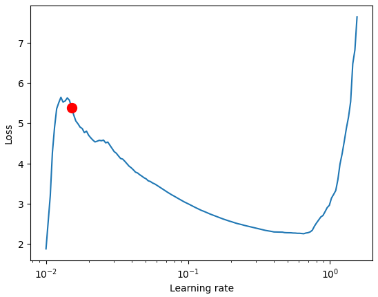
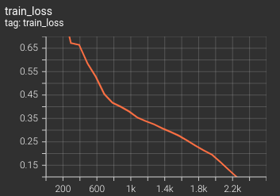
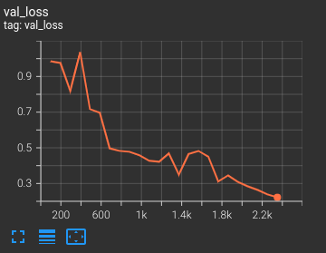
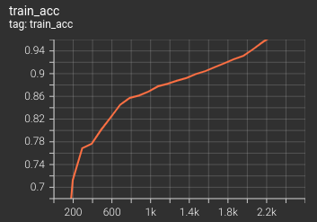
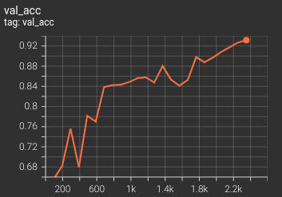
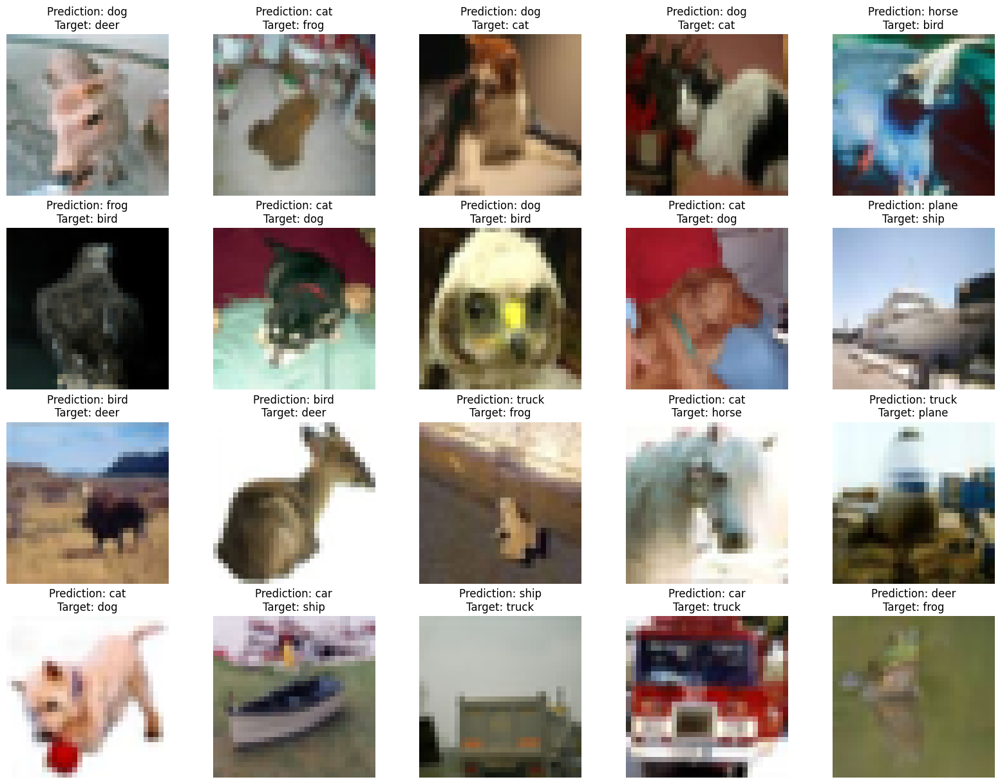
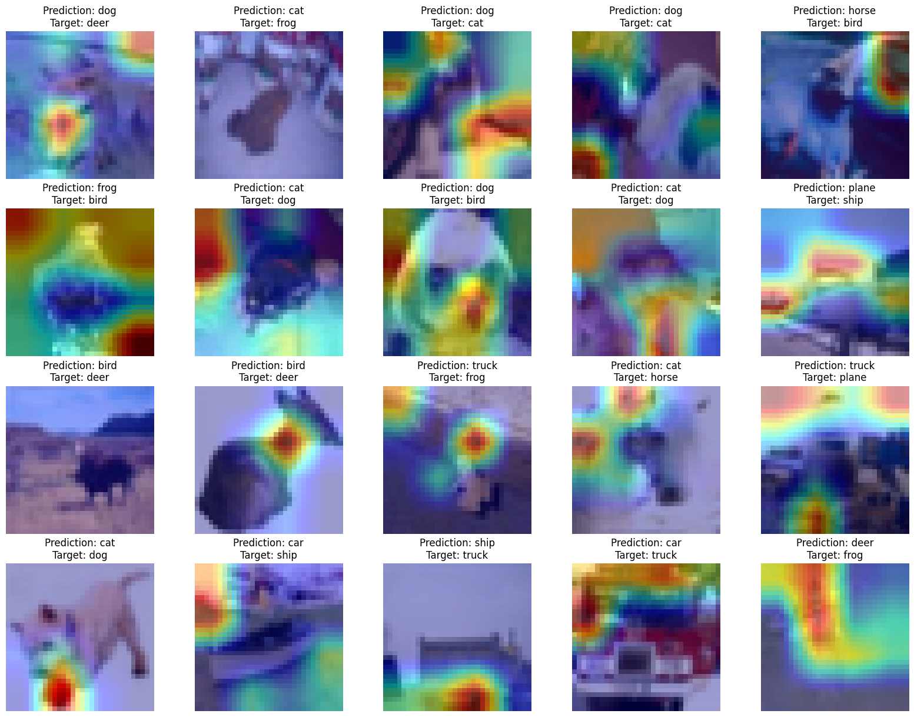

# Session 12 Assignment

This assignment is to learn about pytorch lightning and gradio to showcase your ML models.

Ran the [notebook](S12.ipynb) in colab.

## Usage

- [S12](S12.ipynb) have the ported S10 code into lightning.

- [S12_gradio](S12_gradio.ipynb) have the code for app.py that will be used to showcase on huggingface spaces. You can find the App [here](https://huggingface.co/spaces/gupta1912/ERA-S12)

## OneCycle Learning Curve LR finder

## Train Loss

## Test Loss

## Train Accuracy

## Test Accuracy

## Sample Misclassified images.

## Grad Cam for misclassiffied images.
