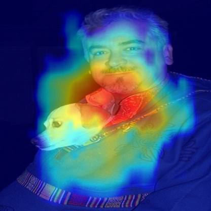

# Session 13 Assignment

1. Move Custom Object Detection Model to Lightning first and then to Spaces such that: 
1. Class accuracy is more than 75% 
2. No Obj accuracy of more than 95% 
3. Object Accuracy of more than 70%
4. Ideally trained till 40 epochs 
2. Add Implement Mosaic Augmentation only 75% of the times 
3. Train on float16 
4. GradCam must be implemented. 
• Once done: 
1. Move the app to HuggingFace Spaces 
2. Allow custom upload of images 
3. Share some samples from the existing dataset 
4. Show the GradCAM output for the image that the user uploads as well as for the samples. 

## Results

### Train Metrics
- Loss: 3.443557024002075
- Class Accuracy: 87.742119%
- NoObject Accuracy: 98.077782%
- Object Accuracy: 80.928574%

### Test Metrics
- Class Accuracy: 90.099754%
- No Object Accuracy: 98.999664%
- Object Accuracy: 73.480186%
- MAP Value:  0.49727123975753784
- [S13](S13.ipynb) main notebook
- [S13_spaces](S13_spaces.ipynb) have the code for app.py that will be used to showcase on huggingface spaces. You can find the App [here](https://huggingface.co/spaces/gupta1912/YoloV3_training_from_scratch)

### Train Loss

### One Cycle LR policy

### Sample Detections

### GradCam examples

## Contributors

- Lavanya Nemani
- Shashank Gupta
