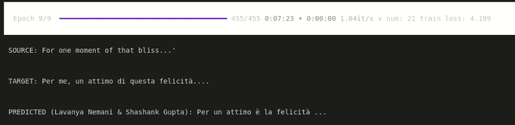
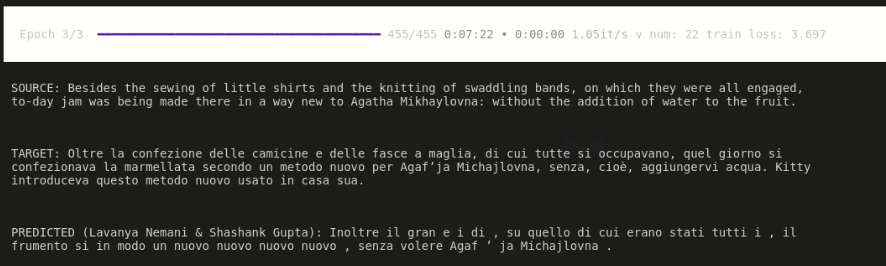

# Session 15 Assignment

1. Rewrite the whole code covered in the class in Pytorch-Lightning
2. Train the model for 10 epochs
3. Achieve a loss of less than 4

## Objective

* The objective of this assignment:

1. Understand the internal structure of transformers, so you can modify at your will
2. Loss should start from 9-10, and reduce to 4, showing that your code is working

## Result

* Loss Epoch 10: 4.199

* Loss Epoch 14: 3.697

## Contributors

- Lavanya Nemani
- Shashank Gupta

