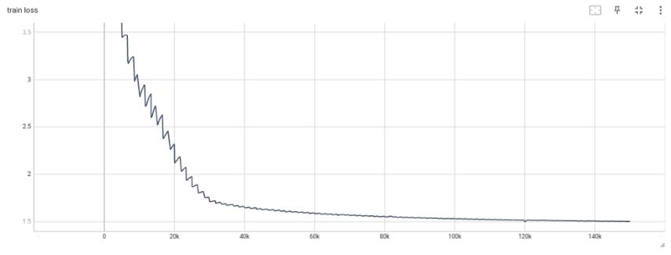
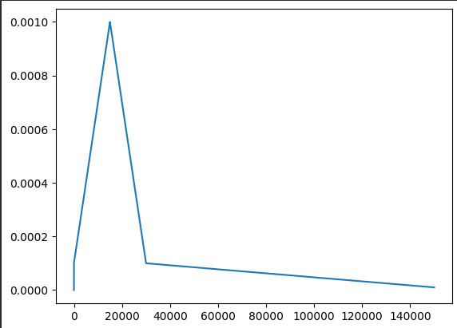

# Session 16 Assignment

## Objective

1. Write Transformer code from scratch and Implement Dynamic Padding and Parameter Sharing to speed the training
2. Train the model and get loss less than 1.8

## Result

Ran for 90 epochs

* Final Train Loss : 1.504
* Train Loss

* Learning Rate Scheduler

## Contributors

- Lavanya Nemani
- Shashank Gupta