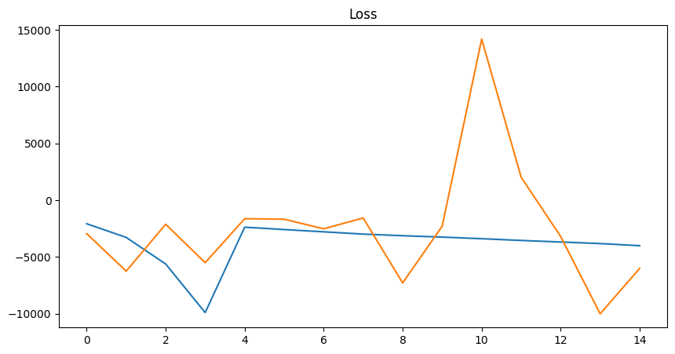

# Session 18 - ERA Phase I - Assignment 

## Objective

1. UNet - Train with the below four variations of architecture/loss

    MP+Tr+BCE
    
    MP+Tr+Dice Loss
    
    StrConv+Tr+BCE
    
    StrConv+Ups+Dice Loss
    
2. VAE - For the following dataset customize to have an input (image and label)

    MNIST
    
    CIFAR10

## Result

1. Example of prediction using UNet 

    A. MP+Tr+BCE

    B. MP+Tr+Dice Loss

    C. StrConv+Tr+BCE

    D. StrConv+Ups+Dice Loss

2. VAE

    A. MNIST --> Input image + 25 different iterations of wrong label

Contributors
-------------------------
Lavanya Nemani 

Shashank Gupta 