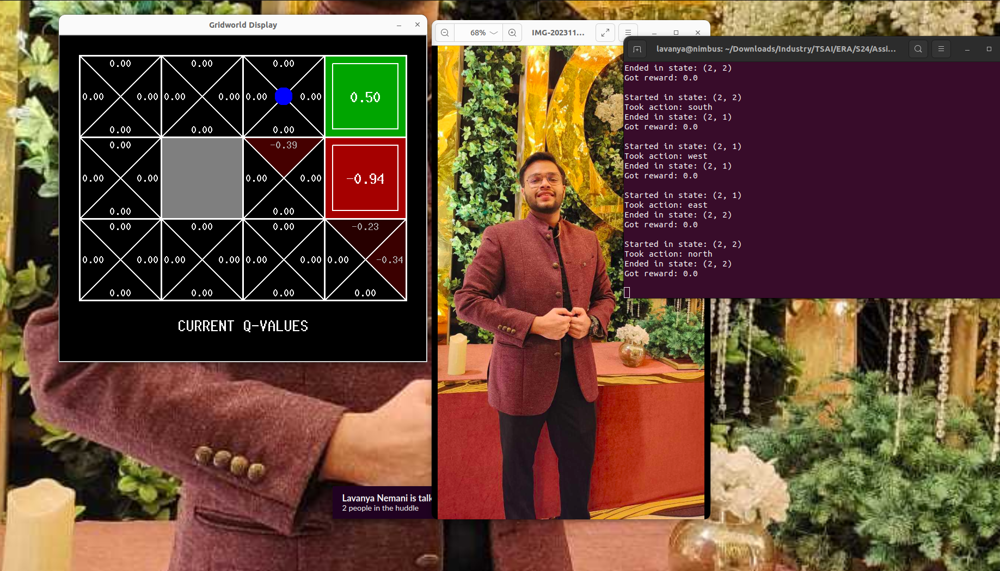

# Session 24 - ERA Phase I - Assignment 

## Goals 
1. Run gridworld, write pseudo-code
    A. __init__
    initializes the q-values of the system to empty dictionary self.qvalues 
    
    B. getQValue
    retrieve the q-value of a state and action if it is self.qvalues else return q-value = 0.0
    
    C. computeValueFromQValue
    value of a state, action is the max of all q-values of that state, possible actions.  
        a. get the q-values for each possible action if it is allowed by checking if action is in self.getLegalActions(state)
        b. max of above q-values is the computeValueFromQValue output. 
        c. if no possible actions can be taken the computeValueFromQValue = 0.0
    
    D. computeActionFromQValues
    for a given state, action is taken by deciding which action gives the max-q-value
        a. first find the best q-value which is simply the value of the state, action = V using computeValueFromQValue
        b. find all possible actions in that state found using actions in self.getLegalActions(state)
        c. find which of these actions gives the max-q-value using getQValue(state, action)
        d. if there are multiple actions which give the max-q-value, we chose an action randomly from them
        e. if there are no possible actions, we don't return action. 
    
    E. getAction(
    action taken at any state are determined by policy and epsilon (which adds randomness to the process)
        a. if random probability <  epsilon, then we chose a random action from all possible actions in that state
        b. Otherwise, we chose the action dictated by the policy using self.getPolicy(state)
    
    F. update
    function to update the q-values during q-learning. state, action, nextState, reward
        a. qvalue(new) is set as = qvalue + alpha * (reward + disc * next_value - qvalue)
        b. where alpha is analogous to learning rate, reward is set by environment,  discount factor is discounts future rewards. 

2. Train our own car-game on a new map with 3 goals. Youtube: https://www.youtube.com/watch?v=v7cvAk3gDeU&ab_channel=LavanyaNemani
    A. What happens when "boundary-signal" is weak when compared to the last reward? 
        This is determined by the Dqn action = brain.update(last_reward, last_signal).
    B. What happens when Temperature is reduced? 
        Temperature controls the exploration-exploitation trade-off. With lower T, reduced exploration and increased exploitation. 
    C. What is the effect of reducing (gamma) ?
        Reducing gamma can have averse results for RL. The agent might not focus on reaching the goal but be happy in staying on roads (achieving current rewards)

Contributors
-------------------------
Lavanya Nemani

Shashank Gupta
