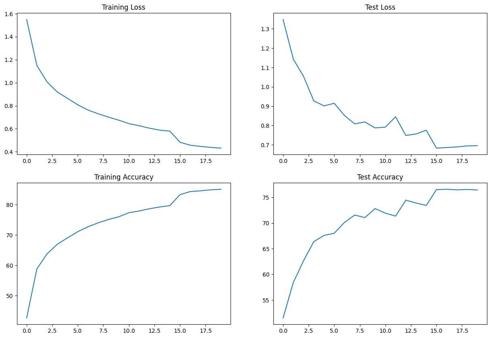

# Session 8 Assignment

This assignment is to learn about different normalization techniques. The objective was to get more than 70% accuracy in test/dev set for CIFAR10 dataset such that model has less than 50,000 parameters and must achieve this in 20 epochs. We have to make three versions of this code one each with Batch Normalization, Layer Normalization and Group Normalization. Tried adding skip connections as well in two layers.

Ran all the notebooks in colab.

## Model with Batch Normalization

- [Notebook Batch Normalization](S8_BN.ipynb)

- Training/Test Accuracy: 84.33%, 76.57%

- Our CNN model summary with Batch Normalization is shown below:

```
----------------------------------------------------------------
        Layer (type)               Output Shape         Param #
================================================================
            Conv2d-1           [-1, 16, 30, 30]             432
              ReLU-2           [-1, 16, 30, 30]               0
       BatchNorm2d-3           [-1, 16, 30, 30]              32
            Conv2d-4           [-1, 32, 28, 28]           4,608
              ReLU-5           [-1, 32, 28, 28]               0
       BatchNorm2d-6           [-1, 32, 28, 28]              64
            Conv2d-7           [-1, 16, 28, 28]             512
         MaxPool2d-8           [-1, 16, 14, 14]               0
            Conv2d-9           [-1, 16, 12, 12]           2,304
             ReLU-10           [-1, 16, 12, 12]               0
      BatchNorm2d-11           [-1, 16, 12, 12]              32
           Conv2d-12           [-1, 32, 10, 10]           4,608
             ReLU-13           [-1, 32, 10, 10]               0
      BatchNorm2d-14           [-1, 32, 10, 10]              64
           Conv2d-15           [-1, 32, 10, 10]           9,216
             ReLU-16           [-1, 32, 10, 10]               0
      BatchNorm2d-17           [-1, 32, 10, 10]              64
           Conv2d-18           [-1, 16, 10, 10]             512
        MaxPool2d-19             [-1, 16, 5, 5]               0
           Conv2d-20             [-1, 16, 5, 5]           2,304
             ReLU-21             [-1, 16, 5, 5]               0
      BatchNorm2d-22             [-1, 16, 5, 5]              32
           Conv2d-23             [-1, 32, 5, 5]           4,608
             ReLU-24             [-1, 32, 5, 5]               0
      BatchNorm2d-25             [-1, 32, 5, 5]              64
           Conv2d-26             [-1, 32, 5, 5]           9,216
             ReLU-27             [-1, 32, 5, 5]               0
      BatchNorm2d-28             [-1, 32, 5, 5]              64
        AvgPool2d-29             [-1, 32, 1, 1]               0
           Conv2d-30             [-1, 10, 1, 1]             320
================================================================
Total params: 39,056
Trainable params: 39,056
Non-trainable params: 0
----------------------------------------------------------------
Input size (MB): 0.01
Forward/backward pass size (MB): 1.28
Params size (MB): 0.15
Estimated Total Size (MB): 1.44
----------------------------------------------------------------
```

- Loss and Accuracy Curves for Train and Test Data.


- Sample missclassified images from Test Data.


## Model with Layer Normalization

- [Notebook Layer Normalization](S8_LN.ipynb)

- Training/Test Accuracy: 84.20%, 76.19%

- Our CNN model summary with Layer Normalization is shown below:

```
----------------------------------------------------------------
        Layer (type)               Output Shape         Param #
================================================================
            Conv2d-1           [-1, 16, 30, 30]             432
              ReLU-2           [-1, 16, 30, 30]               0
         GroupNorm-3           [-1, 16, 30, 30]              32
            Conv2d-4           [-1, 32, 28, 28]           4,608
              ReLU-5           [-1, 32, 28, 28]               0
         GroupNorm-6           [-1, 32, 28, 28]              64
            Conv2d-7           [-1, 16, 28, 28]             512
         MaxPool2d-8           [-1, 16, 14, 14]               0
            Conv2d-9           [-1, 16, 12, 12]           2,304
             ReLU-10           [-1, 16, 12, 12]               0
        GroupNorm-11           [-1, 16, 12, 12]              32
           Conv2d-12           [-1, 32, 10, 10]           4,608
             ReLU-13           [-1, 32, 10, 10]               0
        GroupNorm-14           [-1, 32, 10, 10]              64
           Conv2d-15           [-1, 32, 10, 10]           9,216
             ReLU-16           [-1, 32, 10, 10]               0
        GroupNorm-17           [-1, 32, 10, 10]              64
           Conv2d-18           [-1, 16, 10, 10]             512
        MaxPool2d-19             [-1, 16, 5, 5]               0
           Conv2d-20             [-1, 16, 5, 5]           2,304
             ReLU-21             [-1, 16, 5, 5]               0
        GroupNorm-22             [-1, 16, 5, 5]              32
           Conv2d-23             [-1, 32, 5, 5]           4,608
             ReLU-24             [-1, 32, 5, 5]               0
        GroupNorm-25             [-1, 32, 5, 5]              64
           Conv2d-26             [-1, 32, 5, 5]           9,216
             ReLU-27             [-1, 32, 5, 5]               0
        GroupNorm-28             [-1, 32, 5, 5]              64
        AvgPool2d-29             [-1, 32, 1, 1]               0
           Conv2d-30             [-1, 10, 1, 1]             320
================================================================
Total params: 39,056
Trainable params: 39,056
Non-trainable params: 0
----------------------------------------------------------------
Input size (MB): 0.01
Forward/backward pass size (MB): 1.28
Params size (MB): 0.15
Estimated Total Size (MB): 1.44
----------------------------------------------------------------
```

- Loss and Accuracy Curves for Train and Test Data.


- Sample missclassified images from Test Data.


## Model with Group Normalization

- [Notebook Group Normalization](S8_GN.ipynb)

- Training/Test Accuracy: 83.03%, 73.21%

- Our CNN model summary with Group Normalization is shown below:

```
----------------------------------------------------------------
        Layer (type)               Output Shape         Param #
================================================================
            Conv2d-1           [-1, 16, 30, 30]             432
              ReLU-2           [-1, 16, 30, 30]               0
         GroupNorm-3           [-1, 16, 30, 30]              32
            Conv2d-4           [-1, 32, 28, 28]           4,608
              ReLU-5           [-1, 32, 28, 28]               0
         GroupNorm-6           [-1, 32, 28, 28]              64
            Conv2d-7           [-1, 16, 28, 28]             512
         MaxPool2d-8           [-1, 16, 14, 14]               0
            Conv2d-9           [-1, 16, 12, 12]           2,304
             ReLU-10           [-1, 16, 12, 12]               0
        GroupNorm-11           [-1, 16, 12, 12]              32
           Conv2d-12           [-1, 32, 10, 10]           4,608
             ReLU-13           [-1, 32, 10, 10]               0
        GroupNorm-14           [-1, 32, 10, 10]              64
           Conv2d-15           [-1, 32, 10, 10]           9,216
             ReLU-16           [-1, 32, 10, 10]               0
        GroupNorm-17           [-1, 32, 10, 10]              64
           Conv2d-18           [-1, 16, 10, 10]             512
        MaxPool2d-19             [-1, 16, 5, 5]               0
           Conv2d-20             [-1, 16, 5, 5]           2,304
             ReLU-21             [-1, 16, 5, 5]               0
        GroupNorm-22             [-1, 16, 5, 5]              32
           Conv2d-23             [-1, 32, 5, 5]           4,608
             ReLU-24             [-1, 32, 5, 5]               0
        GroupNorm-25             [-1, 32, 5, 5]              64
           Conv2d-26             [-1, 32, 5, 5]           9,216
             ReLU-27             [-1, 32, 5, 5]               0
        GroupNorm-28             [-1, 32, 5, 5]              64
        AvgPool2d-29             [-1, 32, 1, 1]               0
           Conv2d-30             [-1, 10, 1, 1]             320
================================================================
Total params: 39,056
Trainable params: 39,056
Non-trainable params: 0
----------------------------------------------------------------
Input size (MB): 0.01
Forward/backward pass size (MB): 1.28
Params size (MB): 0.15
Estimated Total Size (MB): 1.44
----------------------------------------------------------------
```

- Loss and Accuracy Curves for Train and Test Data.


- Sample missclassified images from Test Data.


## Results

From these results, we can conclude that for smaller datasets like CIFAR10, BN >> LN >> GN. They all have same parameters but how they are normalised makes them different.