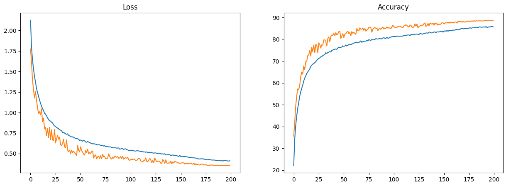
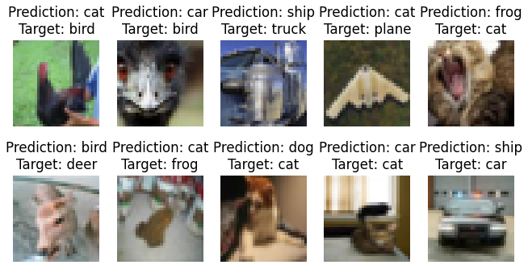

# Session 8 Assignment

This assignment is to learn about different convolutions. The objective was to get more than 85% accuracy in test/dev set for CIFAR10 dataset such that model has less than 200,000 parameters. We have to use at least 1 dilation and 1 depthwise separable convolution. We have to use albumentations library for augmentations. RF should be greater than 44.

__Using dilated kernels instead of max pooling.__

Ran the notebook in colab.

## Model

- [Notebook](Session_9.ipynb)

- Training/Test Accuracy: 85.82%, 88.7%

- Our CNN model summary is shown below:

```
----------------------------------------------------------------
        Layer (type)               Output Shape         Param #
================================================================
            Conv2d-1           [-1, 16, 32, 32]             432
       BatchNorm2d-2           [-1, 16, 32, 32]              32
              ReLU-3           [-1, 16, 32, 32]               0
            Conv2d-4           [-1, 16, 32, 32]           2,304
       BatchNorm2d-5           [-1, 16, 32, 32]              32
              ReLU-6           [-1, 16, 32, 32]               0
            Conv2d-7           [-1, 16, 32, 32]           2,304
       BatchNorm2d-8           [-1, 16, 32, 32]              32
              ReLU-9           [-1, 16, 32, 32]               0
           Conv2d-10           [-1, 16, 16, 16]           2,304
      BatchNorm2d-11           [-1, 16, 16, 16]              32
             ReLU-12           [-1, 16, 16, 16]               0
           Conv2d-13           [-1, 32, 16, 16]           4,608
      BatchNorm2d-14           [-1, 32, 16, 16]              64
             ReLU-15           [-1, 32, 16, 16]               0
           Conv2d-16           [-1, 32, 16, 16]           9,216
      BatchNorm2d-17           [-1, 32, 16, 16]              64
             ReLU-18           [-1, 32, 16, 16]               0
           Conv2d-19           [-1, 32, 16, 16]             320
           Conv2d-20           [-1, 32, 16, 16]           1,056
depthwise_separable_conv-21           [-1, 32, 16, 16]               0
      BatchNorm2d-22           [-1, 32, 16, 16]              64
             ReLU-23           [-1, 32, 16, 16]               0
           Conv2d-24             [-1, 64, 8, 8]          18,432
      BatchNorm2d-25             [-1, 64, 8, 8]             128
             ReLU-26             [-1, 64, 8, 8]               0
           Conv2d-27             [-1, 64, 8, 8]          36,864
      BatchNorm2d-28             [-1, 64, 8, 8]             128
             ReLU-29             [-1, 64, 8, 8]               0
           Conv2d-30             [-1, 64, 8, 8]          36,864
      BatchNorm2d-31             [-1, 64, 8, 8]             128
             ReLU-32             [-1, 64, 8, 8]               0
           Conv2d-33             [-1, 64, 8, 8]          36,864
      BatchNorm2d-34             [-1, 64, 8, 8]             128
             ReLU-35             [-1, 64, 8, 8]               0
           Conv2d-36             [-1, 32, 6, 6]          18,432
      BatchNorm2d-37             [-1, 32, 6, 6]              64
             ReLU-38             [-1, 32, 6, 6]               0
           Conv2d-39             [-1, 16, 4, 4]           4,608
      BatchNorm2d-40             [-1, 16, 4, 4]              32
        AvgPool2d-41             [-1, 16, 1, 1]               0
           Conv2d-42             [-1, 10, 1, 1]             160
================================================================
Total params: 175,696
Trainable params: 175,696
Non-trainable params: 0
----------------------------------------------------------------
Input size (MB): 0.01
Forward/backward pass size (MB): 2.31
Params size (MB): 0.67
Estimated Total Size (MB): 2.99
----------------------------------------------------------------
```

- Loss and Accuracy Curves for Train and Test Data.


- Sample missclassified images from Test Data.

